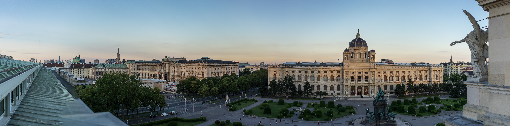

<h1 align=center>

</h1>

# DevelopersRising
  

# Let us help! You are ...

## Aspiring Developer

[Here is how we can help you.](Link)

## Experienced Developer

[Here is how we can help you.](Link)

## Company Hiring

[Here is how we can help you.](Link)

### Table of contents

  - [Documentation on Gitbooks](#documentation-on-gitbooks)
  - [Public Appearance](#public-appearance)
  - [Our work](#our-work)
      - [1. FCC Vienna](#1-fcc-vienna)
      - [2. Vienna Go](#2-vienna-go)
  - [Our Goals](#our-goals)
  - [Our Program](#our-program)
  - [Sponsors](#sponsors)
  - [Organizer Team](#organizer-team)
  - [License](#license)

## Documentation on Gitbooks

- https://developersrising.gitbooks.io/developersrising-documentation/content/

## Public Appearance

- https://twitter.com/DevsRising
- https://www.meetup.com/DevelopersRising/
- https://www.facebook.com/Developers-Rising-273886056453052/
- https://www.instagram.com/developers_rising/
- http://developersrising.org/
- https://medium.com/developersrising

## Our work

> Help, connect and empower!

DevelopersRising is an open source organization dedicated to help developers realize their goals, connect companies with potential hires, and fascilitate growth for all kinds of programmers.

#### Aspiring Developer

#### Experienced Developer

#### Company Hiring

### a brief introduction to our verein

### communicating the mission statement

### Meetups

##### 1. FCC Vienna

https://www.meetup.com/Free-Code-Camp-Vienna/

##### 2. vienna.go - Vienna Go User Group

https://www.meetup.com/Vienna-go-Vienna-Go-User-Group/

## Our Goals
 Our goals are to provide a free and meaningful experience to every human being hungry for learning, sharing and socializing.
we aim to give the chance for those who can't afford it the possibility to learn and evolove. 
## Our Program
---
## Partners
---

## Organizer Team

The Verein is organized by Daniel Deutsch and Robert Axelsen. 

-  [Daniel](https://github.com/DDCreationStudios)
-  [Robert](https://github.com/robeerob)

For feedback, questions or suggestions get in contact with
-  devsrising@gmail.com

You can also open an issue and mention one of us. 😄

## License 

The content of this repository bound by the [BSD-3-Clause](./LICENSE_software.md).

Copyright (c) 2017 DevelopersRising.

